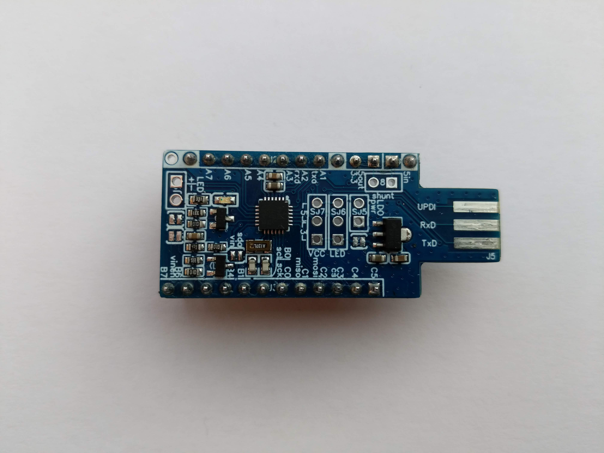
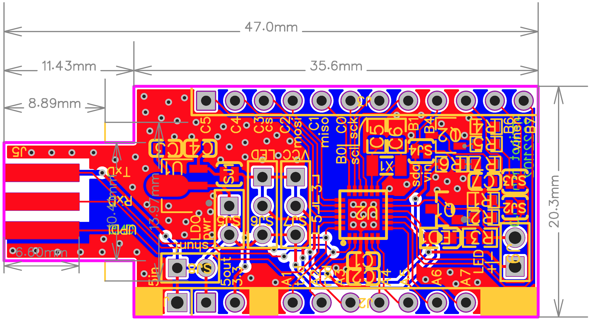

## About the project
This is a developer board for microchip ATtiny3217 (or with same pin output ATtiny1627). With the according [software](https://github.com/2ni/attiny-boilerplate) you can flash the mcu or communicate with it over serial uart.

## Features
- [ATtiny3217](https://www.microchip.com/en-us/product/ATTINY3217)
- only one USB connector needed for flashing and serial communication
- one LED on board
- 32.768kHz quartz for precise RTC and sleep times
- many pinouts
- low quiescent current LDO to 3.3v
- vcc measurement
- one fet powered output
- many jumpers to optimise power and output to get lowest power consumption possible
- easy-to-use connector for flashing/communicating
- any flasher supporing UPDI can also be used
- on a standard breadboard you'll still have 2 holes on each side (width: pin-to-pin is 700mil/17.78mm)
